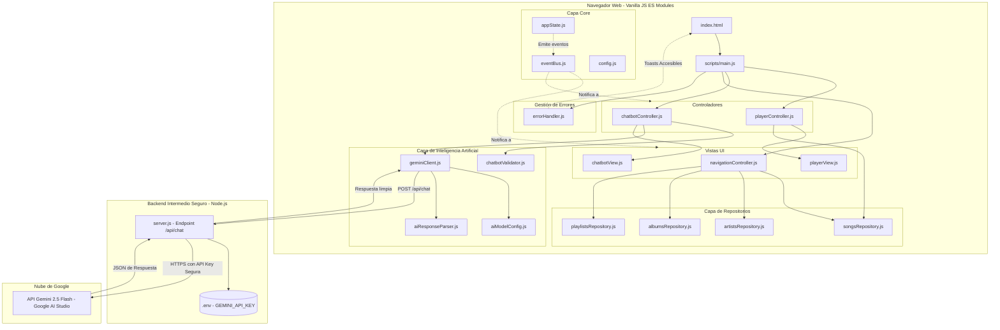
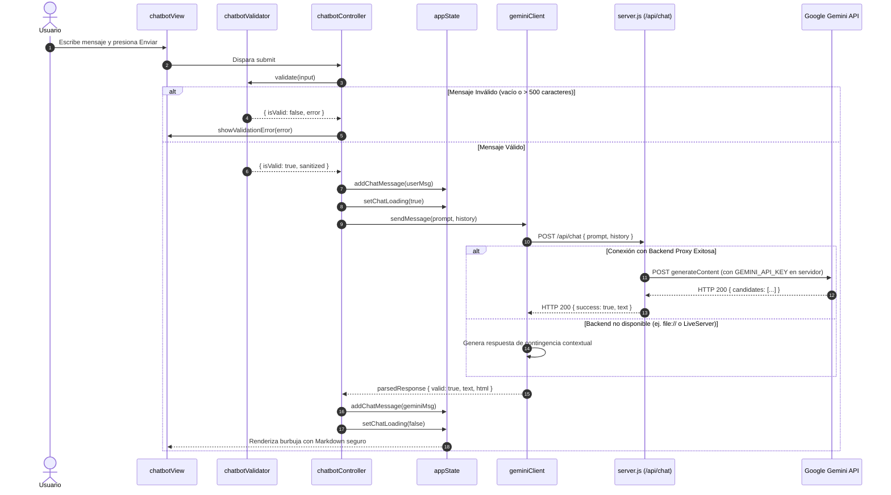

# Especificación de Arquitectura de Software — SoundWave Music App

## 1. Visión General del Sistema

SoundWave es una aplicación web de música inspirada en plataformas modernas de streaming de audio, desarrollada utilizando exclusivamente estándares web nativos (**HTML5 semántico, CSS3 moderno y Vanilla JavaScript con ES Modules**), sin dependencias de frameworks externos como React, Vue o Angular.

El núcleo de la experiencia interactiva incluye un **Chatbot de Inteligencia Artificial** integrado, potenciado conceptual y operativamente por **Gemini 2.5 Flash** (Google AI Studio).

---

## 2. Principios Arquitectónicos Aplicados

1. **Separación de Responsabilidades (SoC)**:
   - Capa de Presentación (HTML/CSS): Semántica, tokens de diseño y diseño responsive.
   - Capa de Vistas (`View`): Manipulación directa del DOM, captura de eventos e interacciones.
   - Capa de Controladores (`Controller`): Orquestación de flujos de negocio y coordinación.
   - Capa de Estado (`appState.js`): Única fuente de verdad (*Single Source of Truth*).
   - Capa de Datos (`Repositories`): Abstracción y acceso a colecciones musicales.
   - Capa de IA (`geminiClient.js`, `aiModelConfig.js`, `aiResponseParser.js`): Comunicación segura y desacoplada con el modelo de lenguaje.
   - Capa de Manejo de Errores (`errorHandler.js`): Centralización y visualización amigable de incidentes.

2. **Principio de Responsabilidad Única (SRP)**:
   - Cada archivo resuelve un problema acotado: `chatbotValidator.js` únicamente valida texto, `sanitizers.js` previene XSS, `formatters.js` da formato a números y tiempos.

3. **Bajo Acoplamiento y Alta Cohesión (Event Bus / Pub-Sub)**:
   - Los módulos no se llaman directamente de forma cruzada. Utilizan `eventBus.js` (`emit`, `on`, `off`) para enterarse de cambios de estado (ej. cuando cambia la pista actual o cuando se abre el chat).

4. **Seguridad y Ocultamiento de Credenciales**:
   - Cumpliendo los requisitos **RNF-04** y **Sección 9.6**, ninguna credencial sensible (`GEMINI_API_KEY`) se escribe en los archivos frontend.
   - La comunicación se gestiona mediante un backend proxy intermedio (`server.js`), que recibe las consultas, adjunta la clave en el entorno del servidor y llama a la API de Google Gemini.

---

## 3. Diagrama de Arquitectura de Módulos

---

## 4. Diagrama de Secuencia: Flujo de Consulta con Gemini 2.5 Flash

---

## 5. Matriz de Requerimientos y Cumplimiento

| ID | Requerimiento | Implementación |
|---|---|---|
| **RF-01** | Navegación entre 8 secciones | Implementado en `navigationController.js` y `index.html`. |
| **RF-02** | Contenido en página principal | Implementado en `navigationController.js` consumiendo repositorios de datos. |
| **RF-03** | Reproductor persistente interactivo | Implementado en `playerController.js` y `playerView.js` con barra de progreso, volumen, play/pause. |
| **RF-04** | Apertura y envío en chatbot | Implementado en `chatbotView.js` y botón flotante/menú. |
| **RF-05** | Respuestas con Gemini 2.5 Flash | Implementado en `geminiClient.js`, `server.js` y `aiModelConfig.js`. |
| **RF-06** | Limpiar conversación | Implementado en botón de papelera en `chat-header` y método en `appState.js`. |
| **RF-07** | Validación de mensajes | Implementado en `chatbotValidator.js` y `validators.js`. |
| **RF-08** | Estados de carga | Implementado con loader de puntos animados en `chatbotView.js` y bloqueo de input. |
| **RF-09** | Manejo de errores claro | Implementado en `errorHandler.js` con notificaciones Toast accesibles. |
| **RNF-01** | Diseño responsive | Breakpoints para Desktop, Tablet y Móvil en `responsive.css`. |
| **RNF-02** | Arquitectura modular | ES Modules independientes en carpetas por dominio (`core`, `navigation`, `player`, `chatbot`, `ai`, `data`, `errors`, `utils`). |
| **RNF-03** | Código mantenible | Nomenclatura camelCase, JSDoc explicativo y separación estricta de responsabilidades. |
| **RNF-04** | Protección de credenciales | API Key gestionada en `.env` mediante `server.js` proxy; `.env` ignorado en Git. |
| **RNF-05** | Accesibilidad básica | HTML semántico, atributos ARIA, navegación por teclado y contraste accesible. |
| **RNF-06** | Manejo centralizado de errores | Clase singleton `errorHandler.js` escuchando eventos globales. |
| **RNF-07** | Escalabilidad | Catálogo desacoplado y configuración aislada en `aiModelConfig.js`. |
