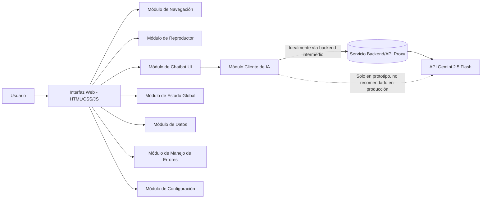
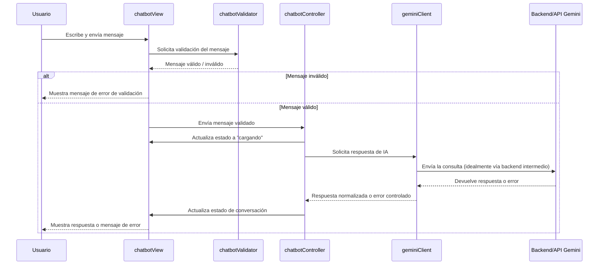

# Plan Técnico de Implementación — Aplicativo Web de Música con Chatbot Gemini 2.5 Flash

## 1. Descripción General

Este documento define el plan técnico completo para construir, desde cero, el frontend de una aplicación web de música inspirada conceptualmente en plataformas de streaming musical modernas. La aplicación se desarrollará con **HTML5, CSS3 y JavaScript vanilla** (sin frameworks), aplicando arquitectura modular y buenas prácticas de ingeniería de software.

La aplicación incorporará un **chatbot de inteligencia artificial** basado en **Gemini 2.5 Flash** (API de Google Gemini / Google AI Studio), integrado como una funcionalidad central de la interfaz, capaz de responder consultas relacionadas con música: recomendaciones de canciones, artistas, álbumes, géneros, estados de ánimo y playlists conceptuales.

Este documento es una **especificación de planeación**. No contiene código de implementación; describe módulos, responsabilidades, flujos, estructura de carpetas y fases de desarrollo para que el proyecto pueda construirse posteriormente siguiendo esta guía.

---

## 2. Objetivos

### 2.1 Objetivo general
Diseñar la arquitectura y el plan de construcción de un sitio web de música con chatbot de IA integrado, usando tecnologías web nativas, siguiendo principios de modularidad, mantenibilidad, seguridad y escalabilidad.

### 2.2 Objetivos específicos
- Definir una arquitectura de carpetas y módulos clara y escalable.
- Establecer el diseño conceptual de la interfaz musical (navegación, página principal, reproductor).
- Definir la integración conceptual con Gemini 2.5 Flash sin exponer credenciales.
- Establecer una estrategia de manejo de estado, errores, seguridad y accesibilidad.
- Entregar un roadmap por fases y criterios de aceptación medibles.

---

## 3. Alcance

### Incluido en el alcance
- Estructura HTML semántica del sitio.
- Diseño visual y responsive mediante CSS.
- Lógica de interfaz en JavaScript vanilla (navegación, estado, UI del reproductor y del chatbot).
- Definición conceptual del cliente de integración con Gemini.
- Definición del archivo `.env` y variables de entorno (sin contenido real).
- Estrategia de seguridad, accesibilidad, manejo de errores y testing.
- Roadmap de implementación por fases.

### Fuera del alcance (en esta etapa)
- Reproducción real de audio (solo se define la estructura para implementarla después).
- Implementación real del backend intermedio (solo se plantea su necesidad y diseño conceptual).
- Persistencia real en base de datos (se definen entidades conceptuales, no esquemas de BD).
- Código fuente de cualquier tipo (HTML, CSS, JS, JSON de configuración).

---

## 4. Requerimientos

### 4.1 Requerimientos funcionales
| ID | Requerimiento |
|----|----------------|
| RF-01 | El usuario puede navegar entre secciones: Inicio, Buscar, Biblioteca, Favoritos, Playlists, Artistas, Álbumes, Chatbot. |
| RF-02 | El usuario puede visualizar contenido destacado, recomendaciones, álbumes, artistas y géneros en la página principal. |
| RF-03 | El usuario puede interactuar con un reproductor persistente (play/pause, anterior/siguiente, progreso, volumen). |
| RF-04 | El usuario puede abrir un chatbot y enviar mensajes de texto. |
| RF-05 | El chatbot responde usando Gemini 2.5 Flash con contenido relacionado a música. |
| RF-06 | El usuario puede limpiar la conversación del chatbot. |
| RF-07 | El sistema valida los mensajes antes de enviarlos (no vacíos, longitud razonable). |
| RF-08 | El sistema muestra estados de carga mientras espera respuesta de Gemini. |
| RF-09 | El sistema maneja y comunica errores de forma clara al usuario. |

### 4.2 Requerimientos no funcionales
| ID | Requerimiento |
|----|----------------|
| RNF-01 | Diseño responsive para desktop, tablet y móvil. |
| RNF-02 | Arquitectura modular con bajo acoplamiento y alta cohesión. |
| RNF-03 | Código mantenible, documentado y siguiendo convenciones de nombres consistentes. |
| RNF-04 | Ninguna credencial sensible debe quedar expuesta en el código fuente del frontend. |
| RNF-05 | Accesibilidad básica (HTML semántico, navegación por teclado, contraste, ARIA cuando aplique). |
| RNF-06 | Manejo centralizado y consistente de errores. |
| RNF-07 | Arquitectura preparada para escalar (nuevos módulos, cambio de modelo de IA, backend futuro). |

---

## 5. Arquitectura General

### 5.1 Visión de alto nivel



### 5.2 Principios arquitectónicos rectores
- **Separation of Concerns**: cada módulo tiene una única responsabilidad (UI, datos, estado, comunicación con IA, errores, configuración).
- **Single Responsibility Principle**: cada archivo/función resuelve un problema concreto y bien delimitado.
- **Bajo acoplamiento / Alta cohesión**: los módulos se comunican mediante interfaces claras (funciones expuestas, eventos, callbacks), evitando dependencias directas innecesarias.
- **DRY**: la lógica repetida (validaciones, formateo, manejo de errores) se centraliza en utilidades compartidas.
- **KISS**: cada módulo resuelve su función de la forma más simple posible, evitando abstracciones prematuras.
- **Encapsulamiento**: el estado interno de cada módulo no se manipula directamente desde otros módulos; se exponen funciones de acceso controlado.

### 5.3 Aplicación de estos principios en JavaScript vanilla
- Uso de **módulos ES (`import`/`export`)** para encapsular cada responsabilidad en su propio archivo.
- Cada módulo expone una API pública mínima (funciones necesarias) y mantiene el resto como privado dentro del archivo.
- El módulo de estado actúa como única fuente de verdad; otros módulos "suscriben" cambios en lugar de leer/escribir variables globales dispersas.
- Los módulos de UI no contienen lógica de negocio; solo renderizan datos y capturan eventos, delegando el procesamiento a los módulos correspondientes (chatbot, reproductor, etc.).
- Las utilidades comunes (validación, formateo de tiempo, manejo de fechas, sanitización) se agrupan en un módulo `utils` reutilizable en todo el proyecto.

---

## 6. Estructura de Carpetas Propuesta

```
music-app/
├── index.html
├── .env                      # No versionado (variables reales, nunca en el repo)
├── .env.example              # Plantilla sin valores sensibles
├── .gitignore
├── README.md
├── /assets
│   ├── /icons
│   ├── /images
│   └── /fonts
├── /styles
│   ├── base.css              # Reset y estilos base
│   ├── variables.css         # Variables de diseño (colores, tipografía, espaciados)
│   ├── layout.css            # Estructura general (grid, header, sidebar)
│   ├── navigation.css
│   ├── player.css
│   ├── chatbot.css
│   ├── cards.css             # Tarjetas de canciones/álbumes/artistas
│   └── responsive.css
├── /scripts
│   ├── /core
│   │   ├── appState.js       # Estado global de la aplicación
│   │   ├── eventBus.js       # Comunicación desacoplada entre módulos (pub/sub)
│   │   └── config.js         # Lectura y exposición de configuración/variables de entorno
│   ├── /navigation
│   │   └── navigationController.js
│   ├── /player
│   │   ├── playerController.js
│   │   └── playerView.js
│   ├── /chatbot
│   │   ├── chatbotController.js   # Orquesta flujo de conversación
│   │   ├── chatbotView.js         # Renderizado de mensajes y UI
│   │   └── chatbotValidator.js    # Validación de entradas del usuario
│   ├── /ai
│   │   ├── geminiClient.js        # Módulo responsable de comunicarse con Gemini
│   │   ├── aiModelConfig.js       # Definición del modelo activo y parámetros
│   │   └── aiResponseParser.js    # Interpretación y normalización de respuestas
│   ├── /data
│   │   ├── songsRepository.js
│   │   ├── artistsRepository.js
│   │   ├── albumsRepository.js
│   │   └── playlistsRepository.js
│   ├── /errors
│   │   └── errorHandler.js        # Manejo centralizado de errores
│   ├── /utils
│   │   ├── validators.js
│   │   ├── formatters.js
│   │   └── sanitizers.js
│   └── main.js                    # Punto de entrada, inicialización de módulos
└── /docs
    └── arquitectura.md
```

> Nota: esta estructura es conceptual y orientativa; puede ajustarse según decisiones de implementación posteriores, siempre manteniendo la separación de responsabilidades.

---

## 7. Componentes y Responsabilidades de Módulos

| Módulo | Responsabilidad |
|--------|------------------|
| `appState.js` | Fuente única de verdad del estado de la aplicación (canción actual, sección activa, estado del chatbot, errores, etc.). Expone funciones para leer y actualizar estado de forma controlada. |
| `eventBus.js` | Mecanismo de publicación/suscripción para que los módulos se comuniquen sin acoplarse directamente. |
| `config.js` | Centraliza el acceso a la configuración (nombre del modelo de IA activo, endpoints, flags de entorno), evitando que otros módulos accedan directamente a variables de entorno. |
| `navigationController.js` | Controla el cambio entre secciones (Inicio, Buscar, Biblioteca, etc.) y actualiza la sección activa en el estado. |
| `playerController.js` / `playerView.js` | Gestionan la lógica y la visualización del reproductor persistente (canción actual, controles, progreso, volumen). |
| `chatbotController.js` | Orquesta el flujo completo del chatbot: recibe el mensaje validado, solicita respuesta al módulo de IA, actualiza el estado de conversación. |
| `chatbotView.js` | Renderiza la ventana de conversación, mensajes, indicador de carga y estados de error. |
| `chatbotValidator.js` | Valida el mensaje del usuario antes de enviarlo (no vacío, longitud, caracteres permitidos). |
| `geminiClient.js` | Único módulo autorizado a comunicarse con la capa de IA (idealmente a través de un backend intermedio). Encapsula la construcción de la solicitud y la interpretación de la respuesta cruda. |
| `aiModelConfig.js` | Define el modelo activo (`gemini-2.5-flash` u otro), parámetros de generación y permite cambiar de modelo sin tocar el resto del sistema. |
| `aiResponseParser.js` | Normaliza la respuesta del modelo a un formato interno consistente que consume el chatbot. |
| `songsRepository.js`, `artistsRepository.js`, `albumsRepository.js`, `playlistsRepository.js` | Encapsulan el acceso a los datos musicales (origen a definir: datos locales de ejemplo, API futura, etc.), exponiendo funciones de consulta. |
| `errorHandler.js` | Punto central de manejo de errores: clasifica el error, decide el mensaje a mostrar y registra información para depuración. |
| `validators.js`, `formatters.js`, `sanitizers.js` | Utilidades reutilizables: validación de formularios/mensajes, formateo de tiempos/textos, sanitización de contenido antes de renderizarlo. |
| `main.js` | Inicializa la aplicación: carga configuración, registra módulos, monta la interfaz inicial. |

---

## 8. Flujo de Funcionamiento General

### 8.1 Flujo de navegación
1. El usuario selecciona una opción del menú principal.
2. `navigationController.js` actualiza la sección activa en `appState.js`.
3. La vista correspondiente se renderiza según el nuevo estado.

### 8.2 Flujo del reproductor (conceptual)
1. El usuario interactúa con un control del reproductor (play, siguiente, volumen).
2. `playerController.js` actualiza el estado de reproducción en `appState.js`.
3. `playerView.js` refleja visualmente el nuevo estado (canción actual, progreso, ícono de play/pause).

> La reproducción real de audio no se implementa en esta fase; se deja preparada la estructura de estado y UI para conectarla posteriormente a una fuente de audio real.

### 8.3 Flujo del chatbot con Gemini



### 8.4 Descripción textual del flujo (según lo solicitado)
1. **Usuario escribe mensaje** en el campo de entrada del chatbot.
2. **Interfaz valida mensaje** (no vacío, longitud aceptable, sin contenido potencialmente peligroso).
3. **Aplicación procesa solicitud**: el controlador del chatbot arma el contexto necesario (historial reciente, tipo de consulta musical).
4. **Módulo de IA realiza la petición** hacia Gemini, idealmente a través de una capa intermedia que protege la API key.
5. **Gemini procesa la consulta** y genera una respuesta relacionada con música.
6. **Aplicación recibe respuesta**, la normaliza y valida que no esté vacía o corrupta.
7. **Interfaz muestra respuesta** en la ventana de conversación, actualizando el historial y quitando el indicador de carga.

---

## 9. Integración Conceptual con Gemini 2.5 Flash

### 9.1 Módulo responsable
El módulo `geminiClient.js` (dentro de `/scripts/ai`) es el **único punto autorizado** para construir y disparar la comunicación con el modelo de IA. Ningún otro módulo debe conocer detalles de la API; solo interactúan con `geminiClient.js` a través de una interfaz simple (por ejemplo, una función que recibe un mensaje y devuelve una respuesta o un error).

### 9.2 Manejo del modelo
- `aiModelConfig.js` centraliza el nombre del modelo activo (`gemini-2.5-flash`) y sus parámetros de generación (temperatura, longitud máxima, instrucciones de sistema conceptuales sobre el dominio musical).
- Si en el futuro se desea cambiar de modelo o de proveedor de IA, solo se modifica este archivo de configuración, sin tocar el resto de la aplicación (principio de bajo acoplamiento).

### 9.3 Manejo de la API key
- La API key **nunca** debe incluirse directamente en archivos HTML o JavaScript del frontend, ni quedar visible en el repositorio.
- Dado que una aplicación puramente frontend no puede ocultar completamente una credencial (cualquier valor incluido en JS es visible en el navegador), se recomienda una **capa backend/API intermedia** (ver sección 9.6) que reciba las solicitudes del frontend, agregue la API key de forma segura del lado del servidor, y reenvíe la solicitud a Gemini.
- El frontend solo debería conocer la URL del backend intermedio, nunca la API key real.

### 9.4 Configuración del `.env`
El archivo `.env` (no versionado) debería contemplar variables como:

| Variable | Propósito |
|----------|-----------|
| `GEMINI_API_KEY` | Credencial de acceso a la API de Gemini. Debe residir únicamente en el entorno del backend/servidor, nunca en el frontend. |
| `GEMINI_MODEL` | Nombre del modelo activo (por ejemplo, referencia conceptual a "gemini-2.5-flash"), para poder cambiarlo sin modificar código. |
| `GEMINI_API_BASE_URL` | URL base del servicio de Gemini o del backend intermedio que la aplicación debe consumir. |
| `APP_ENV` | Entorno de ejecución (desarrollo, pruebas, producción), útil para activar/desactivar logs y comportamientos. |
| `REQUEST_TIMEOUT_MS` | Tiempo máximo de espera para las solicitudes al backend/IA, usado por el manejo de errores por timeout. |

- Estas variables se consumen del lado del servidor/backend intermedio (o mediante un proceso de build controlado), **no directamente desde archivos JavaScript servidos al navegador**.
- `config.js` en el frontend solo debe exponer configuración **no sensible** (por ejemplo, la URL pública del backend intermedio), nunca la API key.
- Información que **nunca** debe incluirse directamente en el código fuente: la API key, tokens de autenticación, URLs privadas de infraestructura interna, o cualquier credencial.

### 9.5 `.gitignore` y prevención de fugas de credenciales
- El archivo `.env` debe añadirse a `.gitignore` para evitar que se suba al repositorio.
- Se recomienda mantener un `.env.example` (sin valores reales) documentando qué variables existen, para que otros desarrolladores sepan qué configurar.
- Antes de cada commit, revisar que no se incluyan archivos con credenciales (buenas prácticas de Git, ver sección 15).
- Si por error una credencial llega a subirse al repositorio, debe rotarse (invalidarse y generar una nueva) inmediatamente, ya que el historial de Git conserva versiones anteriores.

### 9.6 Backend/API intermedio (decisión arquitectónica)
Dado que la aplicación es un frontend estático (HTML/CSS/JS vanilla) y **no existe forma segura de ocultar una API key completamente en el navegador**, se plantea como alternativa arquitectónica la creación de una **pequeña capa backend/API intermedia** cuya única responsabilidad sea:
1. Recibir la consulta del usuario desde el frontend.
2. Adjuntar la API key de Gemini de forma segura (en el entorno del servidor).
3. Reenviar la solicitud a la API de Gemini.
4. Devolver la respuesta (o error) al frontend, sin exponer la credencial en ningún momento.

Esta capa puede evolucionar posteriormente para incorporar límites de uso (rate limiting), registro de solicitudes y validaciones adicionales, pero **su diseño detallado e implementación quedan fuera del alcance de este documento**, que solo plantea la necesidad arquitectónica.

### 9.7 Manejo de errores de la API
`geminiClient.js` debe distinguir al menos las siguientes categorías de error y delegarlas a `errorHandler.js`:
- Error de red (sin conexión, tiempo de espera agotado).
- Error de autenticación (credencial inválida o ausente en el backend intermedio).
- Error de límite de uso (cuota excedida).
- Error de respuesta inválida o inesperada (formato no reconocido).
- Error interno del servidor de Gemini.

### 9.8 Manejo de respuestas vacías o inválidas
- `aiResponseParser.js` valida que la respuesta contenga contenido utilizable antes de entregarla al chatbot.
- Si la respuesta llega vacía, truncada o en un formato no esperado, se genera un error controlado y se muestra un mensaje amigable al usuario (por ejemplo, invitándolo a reformular la pregunta), sin exponer detalles técnicos internos.

### 9.9 Control de estados de carga
- El estado global (`appState.js`) mantiene una bandera de "conversación en curso" mientras se espera la respuesta de Gemini.
- `chatbotView.js` usa esta bandera para mostrar un indicador de carga y deshabilitar temporalmente el envío de nuevos mensajes, evitando solicitudes duplicadas.

### 9.10 Preparación para cambiar de modelo en el futuro
- Toda referencia al modelo activo pasa por `aiModelConfig.js`; ningún otro módulo debe tener el nombre del modelo escrito de forma fija.
- `geminiClient.js` se comunica con la capa de IA a través de una interfaz genérica (enviar mensaje, recibir respuesta), de modo que si se cambia de modelo o incluso de proveedor de IA, solo deben ajustarse `aiModelConfig.js` y, si aplica, la forma en que `geminiClient.js` arma la solicitud — sin afectar al chatbot, la UI ni el resto de la aplicación.

---

## 10. Diseño del Sitio Web

### 10.1 Menú de navegación
Navegación principal conceptual:
- Inicio
- Buscar
- Biblioteca
- Favoritos
- Playlists
- Artistas
- Álbumes
- Chatbot

**Organización:** el menú se ubica en una barra lateral (desktop/tablet) o en una barra inferior/menú desplegable (móvil). Cada opción actualiza la "sección activa" en el estado global, y `navigationController.js` se encarga de mostrar/ocultar el contenido correspondiente sin recargar la página (navegación tipo SPA simple mediante manipulación del DOM).

### 10.2 Página principal
Debe incluir conceptualmente:
- Encabezado con branding y accesos rápidos (buscador, perfil).
- Navegación principal.
- Sección de contenido destacado (hero/banner).
- Canciones recomendadas.
- Álbumes destacados.
- Artistas destacados.
- Géneros musicales.
- Playlists sugeridas.
- Sección de recomendaciones personalizadas (puede alimentarse a futuro por el chatbot o por reglas simples).
- Acceso visible al chatbot (botón flotante o entrada en el menú).

### 10.3 Reproductor musical (conceptual)
Ubicado en una zona persistente (parte inferior de la pantalla), debe mostrar:
- Portada, título de la canción y artista actual.
- Controles: anterior, play/pause, siguiente.
- Barra de progreso y duración total/transcurrida.
- Control de volumen.
- Estado del reproductor (reproduciendo, pausado, sin canción cargada).

No se implementa reproducción real de audio en esta etapa; se define la estructura de estado (`appState.js`) y la vista (`playerView.js`) para que, en una fase posterior, se conecte a una fuente de audio real.

---

## 11. Chatbot: Interfaz y Experiencia de Usuario

### 11.1 Elementos de interfaz
- Botón de acceso al chatbot (visible en toda la aplicación).
- Ventana de conversación (panel lateral o modal).
- Mensajes diferenciados visualmente: usuario vs. Gemini.
- Campo de entrada de texto y botón de enviar.
- Indicador de carga (mientras se espera respuesta).
- Estado de error visible dentro de la conversación.
- Opción para limpiar la conversación.
- Scroll automático hacia el último mensaje.
- Diseño responsive (modal en móvil, panel lateral en desktop).

### 11.2 Comportamiento esperado
| Situación | Comportamiento esperado |
|-----------|---------------------------|
| El usuario abre el chatbot | Se muestra la ventana de conversación, con un mensaje de bienvenida contextual sobre música. |
| Envía un mensaje válido | El mensaje se agrega al historial, se activa el estado de carga y se solicita respuesta a Gemini. |
| El mensaje está vacío | Se bloquea el envío y se muestra una indicación visual (sin llamar a la IA). |
| Gemini está procesando | Se muestra un indicador de carga (por ejemplo, puntos animados) y se deshabilita temporalmente el envío. |
| Gemini responde correctamente | Se agrega la respuesta al historial y se desactiva el estado de carga. |
| Gemini genera un error | Se muestra un mensaje de error amigable dentro de la conversación, sin tecnicismos, y se permite reintentar. |
| Se pierde la conexión | Se detecta el error de red, se informa al usuario y se sugiere reintentar cuando la conexión se restablezca. |
| La respuesta tarda demasiado | Se aplica un timeout configurable (`REQUEST_TIMEOUT_MS`); superado ese tiempo, se cancela la espera y se informa al usuario. |
| Envío de múltiples mensajes rápidos | Se deshabilita el envío mientras haya una solicitud en curso, evitando solicitudes concurrentes o "spam" hacia la API. |

---

## 12. Casos de Uso del Chatbot (Preparación Arquitectónica)

La arquitectura debe permitir, sin necesidad de cambios estructurales, casos de uso como:
- Recomendar canciones, artistas o álbumes.
- Recomendar música según género o estado de ánimo.
- Crear una playlist conceptual a partir de una conversación.
- Explicar información sobre una canción o artista.
- Sugerir música similar a una referencia dada.
- Recomendar música para estudiar, entrenar o relajarse.

Esto se logra manteniendo `chatbotController.js` agnóstico del caso de uso específico: simplemente envía el mensaje del usuario (y opcionalmente contexto adicional, como el catálogo disponible) a `geminiClient.js`, dejando que el modelo interprete la intención. Si en el futuro se requiere lógica especializada (por ejemplo, generar una playlist estructurada), puede añadirse un módulo adicional (`playlistGenerator.js`) sin alterar el resto del sistema.

---

## 13. Arquitectura de Datos (Conceptual)

| Entidad | Responsabilidad / Descripción | Relaciones principales |
|---------|-------------------------------|--------------------------|
| **Usuario** | Representa a la persona que usa la aplicación; conceptualmente contiene preferencias e identificación básica. | Tiene playlists y favoritos. |
| **Canción** | Unidad musical individual (título, duración, referencia a artista y álbum). | Pertenece a un álbum y a uno o más artistas. |
| **Artista** | Representa a un creador musical. | Tiene canciones y álbumes asociados. |
| **Álbum** | Agrupación de canciones bajo un mismo lanzamiento. | Pertenece a uno o más artistas; contiene canciones. |
| **Playlist** | Colección personalizada de canciones creada por el usuario (o sugerida). | Pertenece a un usuario; contiene canciones. |
| **Género** | Clasificación temática/musical. | Se asocia a canciones y álbumes. |
| **Mensaje del chatbot** | Unidad mínima de comunicación dentro de una conversación (emisor: usuario o Gemini, contenido, marca temporal). | Pertenece a una conversación. |
| **Conversación** | Secuencia de mensajes entre el usuario y el chatbot. | Pertenece a un usuario; contiene mensajes. |
| **Recomendación** | Resultado conceptual generado a partir de una interacción con el chatbot o reglas internas, referenciando canciones/artistas/álbumes sugeridos. | Se relaciona con canciones, artistas o álbumes; puede originarse de una conversación. |

---

## 14. Estado de la Aplicación

### 14.1 Información gestionada como estado global
- Canción actual y estado de reproducción (reproduciendo/pausado).
- Volumen actual.
- Playlist actualmente activa.
- Información básica del usuario (si aplica).
- Sección activa de navegación.
- Estado del chatbot (abierto/cerrado, cargando, con error).
- Historial de conversación actual.
- Errores activos (para mostrarlos y luego limpiarlos).

### 14.2 Estrategia para evitar un manejo desordenado del estado
- Todo el estado compartido vive en un único módulo (`appState.js`), evitando variables globales dispersas en distintos archivos.
- El acceso al estado se realiza mediante funciones específicas (getters/setters controlados), nunca modificando el objeto de estado directamente desde otros módulos.
- Los cambios de estado se comunican a través de `eventBus.js`, de modo que las vistas se actualizan reaccionando a eventos en lugar de consultarse constantemente entre sí (evita dependencias cruzadas).
- Los estados de carga y error se tratan como parte del estado global, no como variables sueltas dentro de cada componente, para mantener consistencia en toda la interfaz.

---

## 15. Diseño Responsive

| Elemento | Desktop | Tablet | Mobile |
|----------|---------|--------|--------|
| Menú | Barra lateral fija y expandida | Barra lateral colapsable/iconos | Menú inferior o desplegable tipo hamburguesa |
| Reproductor | Barra inferior completa con todos los controles visibles | Barra inferior con controles esenciales | Barra inferior compacta, controles secundarios en un panel expandible |
| Chatbot | Panel lateral fijo o ventana flotante amplia | Ventana flotante de tamaño medio | Modal a pantalla completa |
| Tarjetas musicales | Cuadrícula de varias columnas | Cuadrícula de 2-3 columnas | Lista o cuadrícula de 1-2 columnas |
| Navegación | Textos e íconos visibles | Íconos con texto opcional | Solo íconos o menú colapsado |
| Espaciado | Espaciado amplio, más "aire" visual | Espaciado intermedio | Espaciado reducido, prioridad al contenido |
| Tipografía | Escala completa de tamaños | Escala intermedia | Tamaños reducidos, priorizando legibilidad táctil |

La estrategia se basa en **mobile-first o breakpoints claros** (a definir en `responsive.css`), usando unidades relativas y flexibilidad de layout (flexbox/grid) en lugar de tamaños fijos.

---

## 16. Accesibilidad

- Uso de **HTML semántico** (`<nav>`, `<main>`, `<button>`, `<header>`, `<footer>`, etc.) en lugar de `<div>` genéricos para elementos interactivos o estructurales.
- **Navegación por teclado** completa: todos los controles (menú, reproductor, chatbot) deben ser accesibles mediante `Tab`/`Enter`/`Espacio`.
- **Labels** asociados a todos los campos de entrada (por ejemplo, el campo de mensaje del chatbot).
- **Estados visibles** de foco (`:focus`) claramente diferenciados visualmente.
- **Contraste** adecuado entre texto y fondo, siguiendo pautas básicas de legibilidad.
- **Texto alternativo** (`alt`) en imágenes de portadas, artistas y álbumes.
- **Botones correctamente identificados** con texto o `aria-label` cuando solo contienen íconos (por ejemplo, el botón de enviar mensaje).
- **Compatibilidad básica con lectores de pantalla**, usando atributos ARIA en elementos dinámicos como el indicador de carga del chatbot o los mensajes nuevos.

---

## 17. Seguridad

### 17.1 Aspectos clave
- **Protección de API keys:** nunca deben incluirse en el código fuente del frontend; deben residir en variables de entorno del lado del servidor/backend intermedio.
- **Variables de entorno:** centralizadas en `.env` (no versionado) y documentadas mediante `.env.example`.
- **`.gitignore`:** debe excluir `.env` y cualquier archivo con credenciales o configuración sensible.
- **Validación de entradas:** todo mensaje del usuario hacia el chatbot debe validarse antes de procesarse (longitud, contenido no vacío).
- **Sanitización de contenido:** cualquier contenido dinámico insertado en el DOM (mensajes del chatbot, datos de canciones) debe sanitizarse para evitar inyección de HTML/scripts.
- **Prevención de XSS:** evitar el uso de inserción directa de HTML no controlado (`innerHTML` con datos crudos); preferir la creación de nodos DOM controlados o sanitización explícita.
- **Manejo de errores:** los errores nunca deben exponer información sensible (rutas internas, claves, mensajes técnicos de la API) directamente al usuario final.
- **Rate limiting (consideración futura):** el backend intermedio debería, a futuro, limitar la cantidad de solicitudes por usuario/tiempo para evitar abuso de la API de Gemini.
- **Backend intermedio:** pieza clave para proteger la API key, como se describe en la sección 9.6.
- **No confiar en datos del cliente:** cualquier dato proveniente del frontend (incluyendo mensajes del chatbot) debe tratarse como no confiable y validarse nuevamente si en el futuro existe un backend propio.

### 17.2 Limitaciones de una aplicación puramente frontend
Una aplicación construida únicamente con HTML, CSS y JavaScript que se ejecuta en el navegador **no puede ocultar completamente ningún secreto**: todo el código y las variables incluidas en el bundle final son visibles e inspeccionables por cualquier usuario mediante las herramientas de desarrollador del navegador. Por esta razón, cualquier credencial sensible (como la API key de Gemini) debe manejarse fuera del alcance del frontend, mediante una capa backend/API intermedia, tal como se planteó en la sección 9.6.

---

## 18. Manejo de Errores

### 18.1 Estrategia centralizada
`errorHandler.js` actúa como punto único de manejo de errores, recibiendo errores desde cualquier módulo (chatbot, reproductor, datos) y decidiendo:
1. Cómo clasificarlos (red, autenticación, validación, límite de API, error interno, timeout).
2. Qué mensaje mostrar al usuario (siempre amigable, nunca técnico).
3. Qué información registrar internamente para depuración (sin exponerla en la interfaz).

### 18.2 Tipos de error contemplados
| Tipo de error | Manejo esperado |
|----------------|------------------|
| Errores de red | Mensaje indicando problemas de conexión; opción de reintentar. |
| Errores HTTP (4xx/5xx) | Clasificación según el código; mensaje genérico apropiado al usuario. |
| Errores de autenticación | Mensaje indicando un problema de configuración/servicio, sin revelar detalles de la credencial. |
| Límites de API (rate limit) | Mensaje indicando que el servicio está temporalmente saturado; sugerir reintento posterior. |
| Respuestas inesperadas | Se descarta la respuesta y se informa que no se pudo procesar la solicitud. |
| Timeouts | Cancelación de la espera tras el tiempo configurado (`REQUEST_TIMEOUT_MS`) y aviso al usuario. |
| Errores de JavaScript (runtime) | Captura mediante manejo de excepciones en puntos críticos; registro interno para depuración. |
| Mensajes inválidos del usuario | Bloqueo preventivo antes de llamar a la IA, con retroalimentación visual inmediata. |
| Fallos de configuración | Verificación temprana (al iniciar la app) de que la configuración necesaria esté disponible; mensaje claro si falta algo esencial. |

---

## 19. Buenas Prácticas de Desarrollo

- **Convenciones de nombres:** camelCase para variables y funciones, PascalCase reservado para posibles constructores/clases, nombres descriptivos y consistentes en todo el proyecto.
- **Organización de archivos:** un módulo por archivo, agrupado por dominio funcional (chatbot, player, ai, data, etc.), como se definió en la sección 6.
- **Comentarios:** explicar el "por qué" de decisiones no triviales, no repetir lo obvio del código.
- **Documentación:** mantener un `README.md` con instrucciones de configuración (incluyendo `.env.example`) y un documento de arquitectura (`/docs/arquitectura.md`).
- **Git:** commits pequeños y descriptivos, siguiendo un formato consistente (por ejemplo, tipo + descripción breve).
- **Ramas:** uso de ramas por funcionalidad (`feature/...`), corrección (`fix/...`) y una rama principal estable.
- **`.gitignore`:** debe excluir `.env`, dependencias locales, archivos temporales y de build.
- **Variables de entorno:** nunca hardcodeadas; siempre accedidas a través del módulo de configuración.
- **Separación de configuración:** la configuración (`config.js`, `.env`) se mantiene aislada de la lógica de negocio.
- **Reutilización de componentes:** utilidades y patrones de UI comunes (tarjetas, botones, indicadores de carga) se diseñan de forma reutilizable.
- **Validación:** aplicada de forma consistente en todos los puntos de entrada de datos del usuario.
- **Testing:** pruebas manuales estructuradas como mínimo (ver sección 20), con posibilidad de introducir pruebas automatizadas a futuro.
- **Debugging:** uso de logs internos controlados (solo en entornos de desarrollo, según `APP_ENV`) para facilitar el diagnóstico sin exponer información en producción.
- **Control de errores:** siempre canalizado a través de `errorHandler.js`, evitando manejo disperso e inconsistente.

---

## 20. Testing (Estrategia Conceptual)

| Tipo de prueba | Enfoque |
|-----------------|---------|
| Funcional | Verificar que cada módulo (navegación, reproductor, chatbot) se comporte según lo especificado en sus flujos. |
| Integración | Verificar la interacción entre `chatbotController`, `geminiClient` y la vista, incluyendo escenarios de éxito y error. |
| Manejo de errores | Simular fallos de red, respuestas vacías, timeouts y mensajes inválidos, verificando que `errorHandler.js` reaccione correctamente. |
| Responsive | Verificar la interfaz en distintos tamaños de pantalla (desktop, tablet, móvil). |
| Accesibilidad | Verificar navegación por teclado, contraste y uso correcto de atributos semánticos/ARIA. |

---

## 21. Roadmap de Implementación por Fases

| Fase | Nombre | Descripción |
|------|--------|--------------|
| 1 | Análisis y arquitectura | Definición final de requerimientos, validación de esta arquitectura y ajustes necesarios antes de codificar. |
| 2 | Inicialización | Creación de la estructura de carpetas, configuración inicial del repositorio, `.gitignore`, `.env.example`. |
| 3 | Estructura HTML | Construcción de la estructura semántica base del sitio (layout, navegación, secciones principales). |
| 4 | Diseño CSS | Implementación del sistema visual, variables de diseño, componentes y estrategia responsive. |
| 5 | JavaScript base | Implementación de los módulos core: estado global, event bus, configuración y manejo de errores. |
| 6 | Aplicación musical | Implementación conceptual de la navegación, tarjetas musicales, reproductor y repositorios de datos de ejemplo. |
| 7 | Chatbot (UI) | Construcción de la interfaz del chatbot: ventana de conversación, validación de mensajes, estados de carga/error. |
| 8 | Integración con Gemini | Implementación del módulo `geminiClient.js`, configuración del modelo y (idealmente) del backend intermedio. |
| 9 | Seguridad | Revisión de exposición de credenciales, sanitización de contenido, pruebas de manejo de errores sensibles. |
| 10 | Testing | Ejecución de pruebas funcionales, de integración y de manejo de errores descritas en la sección 20. |
| 11 | Optimización | Ajustes de rendimiento, accesibilidad y experiencia de usuario general. |
| 12 | Documentación | Redacción final de `README.md` y documentación técnica de arquitectura. |

---

## 22. Criterios de Aceptación

- [ ] El sitio web fue construido desde cero con HTML5, CSS3 y JavaScript vanilla, sin frameworks frontend.
- [ ] La navegación entre todas las secciones definidas (Inicio, Buscar, Biblioteca, Favoritos, Playlists, Artistas, Álbumes, Chatbot) funciona correctamente.
- [ ] El diseño es responsive y se adapta correctamente a desktop, tablet y móvil.
- [ ] La arquitectura del proyecto es modular, con responsabilidades claramente separadas entre archivos/módulos.
- [ ] El chatbot está integrado en la interfaz y es accesible desde cualquier sección relevante.
- [ ] El chatbot utiliza Gemini 2.5 Flash como modelo de generación de respuestas.
- [ ] La configuración sensible (API key, endpoints) se maneja mediante variables de entorno, nunca hardcodeada.
- [ ] La API key de Gemini no está expuesta en el código fuente del frontend ni en el repositorio.
- [ ] Existe una estrategia centralizada y consistente de manejo de errores.
- [ ] El código está organizado siguiendo la estructura de carpetas y convenciones definidas en este documento.
- [ ] Se respeta la separación de responsabilidades entre UI, estado, datos, IA y manejo de errores.
- [ ] Se cumplen los criterios básicos de accesibilidad (HTML semántico, navegación por teclado, contraste, texto alternativo).
- [ ] El proyecto cuenta con documentación técnica (`README.md` y documento de arquitectura).
- [ ] Se siguen buenas prácticas de Git (`.gitignore` correcto, commits descriptivos, ausencia de credenciales en el historial).

---

## 23. Consideraciones Futuras

- Implementación de reproducción real de audio conectando el reproductor a una fuente de streaming o archivos reales.
- Desarrollo completo del backend/API intermedio para proteger la API key y centralizar la comunicación con Gemini.
- Incorporación de rate limiting y monitoreo de uso de la API de IA.
- Persistencia real de datos (usuarios, playlists, historial de conversación) mediante una base de datos.
- Posible generación de playlists estructuradas directamente a partir de las respuestas del chatbot.
- Internacionalización (i18n) de la interfaz si se requiere soporte multilenguaje.
- Introducción de pruebas automatizadas (unitarias y de integración) conforme crezca la base de código.
- Evaluación de mecanismos de autenticación de usuarios si la aplicación evoluciona hacia perfiles personalizados persistentes.
